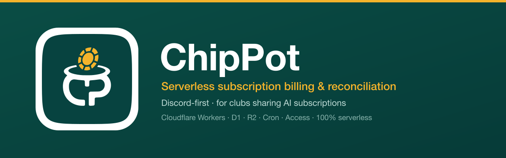

<div align="center">



<br/>

**Discord-first subscription billing & reconciliation for clubs that co-buy AI subscriptions — 100% serverless on Cloudflare.**


<br/>

**English** · [繁體中文](README.zh-TW.md)

</div>

---

ChipPot started life solving a very concrete problem: a club bulk-buys OpenAI / Anthropic
subscriptions and splits the cost across members. Collecting and reconciling everyone's monthly
payment over a spreadsheet is painful. ChipPot moves the whole loop **into Discord** — members
pay with a button, the bot tracks who owes / paid / verified, and an admin dashboard handles
reconciliation — all running on Cloudflare's free-tier serverless stack.

It's built with a **core / channel-adapter split** (Discord today; LINE / Telegram are
pre-wired) and a multi-workspace-ready data model, so it generalizes well beyond one club.

## Table of contents

- [Highlights](#highlights)
- [How a payment flows](#how-a-payment-flows)
- [Architecture](#architecture)
- [Tech stack](#tech-stack)
- [Project layout](#project-layout)
- [Quick start](#quick-start)
- [Deployment](#deployment)
- [Configuration](#configuration)
- [Admin & operations](#admin--operations)
- [Roadmap](#roadmap)
- [License](#license)

## Highlights

- 💳 **Discord-first payments** — a persistent **繳費** button → pick a channel → done. One submit
  settles *all* of a member's subscriptions for the period (multi-plan aggregation).
- 🔗 **Self-service linking** — members link their Discord account to the roster themselves
  (`/綁定`, the pay button, or a persistent public **綁定** button posted in the channel); admins can also assign IDs by hand.
- 📥 **CSV roster import** — onboard an existing roster (e.g. a Google-Forms export) in one upload:
  upsert members + subscriptions, idempotent re-runs.
- 🧾 **Review queue + reconciliation** — an admin dashboard with per-plan / per-channel totals, a
  one-click verify queue, manual back-fill, single-payment delete, undo-verify, and frozen period
  amounts (price changes never rewrite history). A **重新同步本期帳單** action re-aligns an opened
  period's bills to the current roster/price (preview before applying), optionally pinging newly-added members.
- 🔔 **Customizable notifications** — editable templates (with live preview + validation) for the
  billing-opened notice, the batched overdue reminder, and the persistent pay message.
- 📲 **Submission alerts** — when a member submits a payment, push the owner a Bark and/or webhook
  notice (Discord / Google Chat / Slack — body shape auto-detected by host) with a deep link
  straight to that payment's review row.
- ⏰ **Daily cron, idempotent** — opens billing, sends one batched overdue reminder per period, and
  enforces screenshot retention — all deduped through `notification_logs`.
- 🛡️ **Access-gated admin** — the whole admin host sits behind Cloudflare Access (email OTP); the
  SPA and its API are same-origin so the Access JWT reaches the Worker.
- 🧪 **Real-runtime tests** — 234 Vitest cases run against actual Miniflare D1 + R2 (FK constraints
  enforced), not mocks.

## How a payment flows

```
Member taps 「繳費」 (or /繳費)
        │
        ├─ not linked yet? → "選你的名字" dropdown → binds their Discord id, then continues
        │
        ▼
  ephemeral: this period's plans + total + a channel select
        │  (screenshot / note optional via /繳費 or the web page)
        ▼
  settleUserPeriod() — marks every pending/rejected payment "paid", one shared proof key
        │
        ▼
  Admin dashboard → review queue → ✅ verify (declared channel pre-filled)
```

A `payment` row is a **bill** (an obligation), created the moment a member has a subscription or by
the monthly cron. Its lifecycle: `pending → paid → verified` (or `rejected`, re-payable). The
amount is frozen per period, so changing a plan's price never alters past bills.

## Architecture

```
Discord  ─┐                              ┌─ D1  (chippot-db)         — SQLite ledger
Web 上傳 ─┼─►  Cloudflare Worker  ───────┤─ R2  (chippot-proofs)     — private screenshots
Admin UI ─┤    core + adapters           └─ Cron (daily 01:00 UTC)   — billing / overdue / retention
Cron     ─┘
```

- **Core** `worker/src/core/*` — channel-agnostic domain: `time` (Asia/Taipei), `tokens`, `audit`,
  `payments` (state machine), `billing`, `reconcile`, `storage` (R2 + compensation), `notify`,
  `templates`, `import`, `scheduled`, `retention`.
- **Discord adapter** `worker/src/adapters/discord/*` — Ed25519 signature verification, slash
  commands (`/繳費` · `/發起繳費` · `/綁定`), buttons, string-selects, modals, and notifications.
- **Routes** `worker/src/routes/*` — `/interactions` (Ed25519) · `/upload/:token` (one-time token)
  · `/admin/*` + `/admin/image` (Access JWT) · `/images`.
- **Frontends** — `packages/web` (token-gated upload page) and `packages/admin` (the dashboard SPA),
  both Vite + React deployed to Cloudflare Pages.

### Admin Access model

`admin.example.com` is fully protected by Cloudflare Access. The SPA is served from Pages, while
the admin API is the **same Worker** via a route on `admin.example.com/api/*` (the Worker strips
`/api`). Because it's same-origin, the Access JWT (`Cf-Access-Jwt-Assertion`) reaches the Worker,
where `requireAccess` verifies `aud` / `iss` / `exp` and an email allow-list. Screenshots stream
through a same-origin protected endpoint, so `` tags just work.

## Tech stack

| Layer | Tech |
|---|---|
| Runtime | Cloudflare Workers (TypeScript, `nodejs_compat`) |
| Data | D1 (SQLite) · R2 (object storage) |
| Scheduling | Cron Triggers (daily) |
| Auth | Cloudflare Access (admin) · Ed25519 (Discord) · one-time hashed tokens (upload) |
| Frontend | Vite + React 18 → Cloudflare Pages |
| Tests | Vitest 4 + `@cloudflare/vitest-pool-workers` (Miniflare D1/R2) |
| Tooling | pnpm workspaces · Wrangler |

## Project layout

```
packages/
  worker/                 Cloudflare Worker (API + Discord + Cron)
    src/core/             channel-agnostic domain logic
    src/adapters/discord/ Ed25519 verify · commands · handler · notify
    src/routes/           interactions · upload · admin · images
    migrations/           D1 schema (0001…0004)
    scripts/              register-commands.mjs
    test/                 Vitest (real Miniflare D1/R2)
  web/                    public token-gated upload page (Vite/React)
  admin/                  Access-gated admin SPA (Vite/React)
assets/                   logo + banner
docs/                     specs & implementation plans
```

## Quick start

> Requires [pnpm](https://pnpm.io) and a [Cloudflare account](https://dash.cloudflare.com) with
> Wrangler authenticated for deploys.

```bash
pnpm install

# Worker — tests run against real Miniflare D1 + R2
pnpm --filter @chippot/worker test
pnpm --filter @chippot/worker typecheck
pnpm --filter @chippot/worker dev          # local wrangler dev

# Frontends — the web build requires VITE_API_BASE (your worker URL); admin does not
VITE_API_BASE=https://chippot.<your-subdomain>.workers.dev pnpm --filter @chippot/web build
pnpm --filter @chippot/admin build
```

Test convention: storage isolation is **per test file**; Miniflare's D1 enforces FK constraints,
so DB tests seed real parents and use a distinct id-space (9001+).

## Deployment

> **Deploying to your own Cloudflare account?** Follow the complete step-by-step runbook in
> **[docs/DEPLOY.md](docs/DEPLOY.md)** (繁體中文) — it covers creating the D1/R2/Pages resources,
> Cloudflare Access, the Discord app, secrets, custom domains, and first-run configuration. The
> commands below are the quick reference once those resources exist.

```bash
# 1. Worker — applies D1 migrations, then deploys (carries the cron + admin.example.com/api route)
pnpm --filter @chippot/worker run deploy

# 2. Frontends → Pages (the web build needs VITE_API_BASE = your worker URL)
cd packages/web   && VITE_API_BASE=https://chippot.<your-subdomain>.workers.dev pnpm build && wrangler pages deploy dist --project-name chippot-web   --branch main
cd packages/admin && pnpm build && wrangler pages deploy dist --project-name chippot-admin --branch main

# 3. Register the guild slash commands (/繳費 · /發起繳費 · /綁定) — needs DISCORD_BOT_TOKEN, DISCORD_APPLICATION_ID, DISCORD_GUILD_ID in packages/worker/.dev.vars
pnpm --filter @chippot/worker register
```

Provision your own resources (D1 and an Access application; **R2 is optional** — only needed for
payment screenshots) and fill in `wrangler.toml` accordingly — `database_id`, the R2 bucket (drop
`[[r2_buckets]]` to skip), `ACCESS_*`, and the Discord vars.

## Configuration

- **Secret** — `DISCORD_BOT_TOKEN` (`wrangler secret put`; locally in
  `packages/worker/.dev.vars`, which is gitignored).
- **Vars** (`wrangler.toml`, non-secret) — `DISCORD_APPLICATION_ID`, `DISCORD_PUBLIC_KEY`,
  `WEB_ORIGIN`, `ADMIN_ORIGIN`, `ACCESS_TEAM_DOMAIN`, `ACCESS_AUD`.
- **Workspace settings** (in D1, edited from the admin **Settings** page) — billing day, overdue
  days, screenshot retention, Discord guild / channel ids, the admin allow-list
  (`admin_discord_ids`), the three editable notification templates, and optional
  **payment-submission alerts** (a Bark URL template and/or an incoming webhook; the alert's review
  deep link is built from `ADMIN_ORIGIN`, so no extra config is needed for it).
- **Discord** — set the app's Interactions Endpoint to the Worker's `/interactions`, then register
  the guild commands with the script above.

## Admin & operations

- **Members & subscriptions** — add manually or bulk-import a CSV; creating a subscription opens
  its first period bill.
- **Review queue** — Payments → status pills → the **已繳待驗** queue floats to the top → one-click
  ✅ verify (or open a row for screenshots, channel, reject, amount override, delete proof, **撤回驗證**
  to undo a mistaken verify, or **delete the whole bill**).
- **重新同步本期帳單** — on Payments, re-align the selected opened period's bills to the current
  roster/price (add missing · remove de-subscribed · reprice pending · freeze settled), with a preview
  before applying and an option to ping newly-added members with the pay button.
- **發起繳費** — confirm this period's per-plan amounts (any change becomes the plan's new price),
  then post the billing-opened notice. Triggerable from the admin Settings or Discord's `/發起繳費`.
- **綁定按鈕** — Settings → 工具 → post a persistent public **綁定 Discord** button to the channel so
  members self-link proactively (in addition to binding at first payment).
- **Push status** — the dashboard shows whether the billing-opened / overdue notices went out, with
  **Resend now** (force) and **Reset** controls.
- **Submission alerts** — set a Bark URL and/or a webhook (Discord / Google Chat / Slack) under
  Settings → 繳費通知; each new submission then pushes you a notice with a one-tap deep link to its
  review row. Both are optional and best-effort (a slow or failing endpoint never blocks the payment).
- **Daily cron** (01:00 UTC = 09:00 Asia/Taipei) — idempotently opens each period's bills, posts the
  billing-opened notice (tagging plan roles), sends **one batched overdue reminder per period**
  listing all unpaid members, and runs screenshot retention. Everything dedups via `notification_logs`.

## Roadmap

Interfaces are in place; these are intentionally not yet built:

- Multi-workspace switcher UI
- LINE / Telegram adapters (the core is already channel-agnostic)
- Orphan-R2 sweeper cron
- `plans.billing_cycle` (yearly) and `split_count` (cost splitting)

## License

Released under the [MIT License](LICENSE). © 2026 PoterPan.

<div align="center"><sub>Built with a core / adapter split · TDD · 100% serverless.</sub></div>
