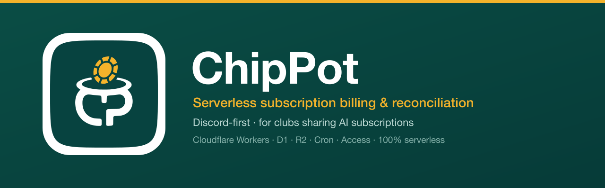

<div align="center">



<br/>

**為「合買 AI 訂閱」的社團打造的 Discord-first 訂閱代收與對帳系統 — 100% serverless on Cloudflare。**


<br/>

[English](README.md) · **繁體中文**

</div>

---

ChipPot 解決的是一個很具體的痛點：社團大量採購 OpenAI / Anthropic 訂閱、再把費用攤給成員。
用試算表逐月收款、對帳很煩。ChipPot 把整個流程**搬進 Discord**——成員按按鈕繳費、機器人追蹤
誰欠／已繳／已驗證，後台再做對帳——而且全部跑在 Cloudflare 免費級的 serverless 架構上。

它採**核心層／管道 adapter 層分離**（目前 Discord，已預留 LINE / Telegram），資料模型也支援
多帳本（workspace），所以不只適用單一社團。

## 目錄

- [亮點](#亮點)
- [一筆繳費怎麼跑](#一筆繳費怎麼跑)
- [架構](#架構)
- [技術棧](#技術棧)
- [專案結構](#專案結構)
- [快速開始](#快速開始)
- [部署](#部署)
- [設定](#設定)
- [後台與營運](#後台與營運)
- [後續規劃](#後續規劃)
- [授權](#授權)

## 亮點

- 💳 **Discord 內繳費** — 常駐「繳費」按鈕 → 選渠道 → 完成。一次送出就把該成員**當期所有訂閱**
  一起結清（多方案加總）。
- 🔗 **自助綁定** — 成員自己把 Discord 帳號接到名單：`/綁定`、繳費按鈕，或帳單頻道裡常駐的公開
  **綁定 Discord** 按鈕。名單超過 Discord 選單的 25 筆上限時改用搜尋（`/綁定` 的「名字」自動完成，
  或按鈕跳出的搜尋彈窗）。管理員也能手動指定 ID，或**解除綁定**讓成員重新綁。
- 🧾 **審核結果會回到成員手上** — 退回一定在頻道 @ 當事人並附上原因（成員唯一知道要重繳的管道，
  不能關閉）；確認收款則可自行選擇要不要通知。一位成員同期多筆合併成一則，不洗版。
- 📄 **`/我的帳單`** — 成員自助查詢目前待繳與最近 6 筆紀錄，數字與「繳費」按鈕同源。
- 🔁 **綁錯名字可自助解綁重綁** — 兩段確認、全程僅本人可見，解綁與重綁都寫入稽核；
  只能釋放自己那一列。
- 🔔 **入職通知與個別催繳** — CSV 匯入、新增訂閱、重新同步都能在建立帳單的當下 @ 通知；
  成員×期別頁可單獨催繳某一位。全部去重，並照實列出**未綁定、@ 不到**的人。
- 📥 **CSV 名單匯入** — 一次上傳就能建立**並維護**名單（例如 Google 表單匯出）：方案欄填 `TRUE`
  代表訂閱（或恢復暫停中的訂閱），`FALSE` 代表暫停該訂閱，留空則完全不動。每次上傳都會先顯示完整
  差異預覽（新成員、新增／暫停／恢復的訂閱、對不到的方案、需人工處理的已取消訂閱）再套用，可冪等重跑。
- 🧾 **審核佇列 + 對帳** — 後台看板有各方案／各渠道金額、一鍵驗證佇列、手動補登、單筆繳費刪除、
  **撤回驗證**（誤按的驗證可還原），且**當期金額凍結**（改價不會回頭改歷史帳）。**重新同步本期帳單**
  會把已開期別的帳單重新對齊目前名單／現價（先看差異預覽再套用），並可順便 @ 通知新加進來的成員。
  點成員名字（或從繳費推播點進來）會開啟**成員×期別合併審核**：共用截圖只出現一次、當期每一筆都列出，
  已繳待驗的可一鍵全部核准。佇列、這個畫面與審核彈窗在手機上都能用。
- 🔔 **可自訂通知** — 開繳通知、整批逾期催繳、常駐繳費訊息三種文字皆可自訂模板（含即時預覽 + 格式驗證）。
- 📲 **繳費推播** — 成員送出繳費時，可推一則 Bark 和／或 webhook（Discord／Google Chat／Slack，body
  格式依主機自動判斷）給擁有者，並帶上直接跳到該成員該期審核的深連結——一次送出會結清所有訂閱，
  所以連結會把它們一起打開，可一鍵全部核准。
- ⏰ **每日 cron、冪等** — 自動開帳、進入催繳後**每天發一則**整批催繳（直到全部繳完）、執行
  截圖保存期清理，全部經 `notification_logs` 去重。
- 🛡️ **Access 保護的後台** — 整個後台主機在 Cloudflare Access 後（email OTP）；SPA 與其 API 同源，
  Access JWT 因此能到達 Worker。
- 🧪 **真環境測試** — 426 個 Vitest 案例跑在真正的 Miniflare D1 + R2（強制 FK 約束），不是 mock。

## 一筆繳費怎麼跑

```
成員按「繳費」（或 /繳費）
        │
        ├─ 還沒綁定？ → 「選你的名字」下拉 → 綁定 Discord id 後，接著繳費
        │
        ▼
  ephemeral：列出本期各方案 + 總額 + 渠道下拉
        │  （/繳費 或網頁可另附截圖／備註）
        ▼
  settleUserPeriod() — 把每筆 pending/rejected 標記為「已繳」，共用同一張截圖 key
        │
        ▼
  後台看板 → 審核佇列 → ✅ 驗證（自動帶入申報渠道）
```

一筆 `payment` 代表一張**帳單（應繳義務）**，在成員擁有訂閱、或每月 cron 時建立。生命週期：
`pending → paid → verified`（或 `rejected`，可再繳）。金額按期凍結，所以改方案價格不會動到過去的帳。

## 架構

```
Discord  ─┐                              ┌─ D1  (chippot-db)         — SQLite 帳本
網頁上傳 ─┼─►  Cloudflare Worker  ───────┤─ R2  (chippot-proofs)     — 私有截圖
後台 UI  ─┤    core + adapters           └─ Cron（每日 01:00 UTC）   — 開帳 / 催繳 / 保存期
Cron     ─┘
```

- **核心層** `worker/src/core/*` — 與管道無關：`time`（Asia/Taipei）、`tokens`、`audit`、
  `payments`（狀態機）、`billing`、`reconcile`、`storage`（R2＋補償）、`notify`、`templates`、
  `import`、`scheduled`、`retention`。
- **Discord adapter** `worker/src/adapters/discord/*` — Ed25519 驗章、slash 指令
  （`/繳費` · `/發起繳費` · `/綁定`）、按鈕、string-select、modal、通知。
- **Routes** `worker/src/routes/*` — `/interactions`（Ed25519）· `/upload/:token`（一次性 token）
  · `/admin/*` + `/admin/image`（Access JWT）· `/images`。
- **前端** — `packages/web`（token-gated 上傳頁）與 `packages/admin`（後台 SPA），皆 Vite + React，
  部署到 Cloudflare Pages。

### 後台 Access 模型

`admin.example.com` 整台主機受 Cloudflare Access 保護。SPA 在 Pages；後台 API 則是**同一個 Worker**，
透過 `admin.example.com/api/*` 路由（Worker 會去掉 `/api` 前綴）。因為同源，Access JWT
（`Cf-Access-Jwt-Assertion`）會到達 Worker，由 `requireAccess` 驗證 `aud` / `iss` / `exp` 與 email
白名單。截圖走同源的受保護端點，所以 `` 直接可用。

## 技術棧

| 層 | 技術 |
|---|---|
| 執行環境 | Cloudflare Workers（TypeScript、`nodejs_compat`） |
| 資料 | D1（SQLite）· R2（物件儲存） |
| 排程 | Cron Triggers（每日） |
| 驗證 | Cloudflare Access（後台）· Ed25519（Discord）· 一次性雜湊 token（上傳） |
| 前端 | Vite + React 18 → Cloudflare Pages |
| 測試 | Vitest 4 + `@cloudflare/vitest-pool-workers`（Miniflare D1/R2） |
| 工具 | pnpm workspaces · Wrangler |

## 專案結構

```
packages/
  worker/                 Cloudflare Worker（API + Discord + Cron）
    src/core/             與管道無關的核心邏輯
    src/adapters/discord/ Ed25519 驗章 · 指令 · handler · 通知
    src/routes/           interactions · upload · admin · images
    migrations/           D1 schema（0001…0007）
    scripts/              register-commands.mjs
    test/                 Vitest（真 Miniflare D1/R2）
  web/                    公開的 token-gated 上傳頁（Vite/React）
  admin/                  Access 保護的後台 SPA（Vite/React）
assets/                   logo + banner
docs/                     規格與實作計畫
```

## 快速開始

> 需要 [pnpm](https://pnpm.io) 與已登入 Wrangler 的 [Cloudflare 帳號](https://dash.cloudflare.com)（部署用）。

```bash
pnpm install

# Worker — 測試跑在真 Miniflare D1 + R2
pnpm --filter @chippot/worker test
pnpm --filter @chippot/worker typecheck
pnpm --filter @chippot/worker dev          # 本地 wrangler dev

# 前端 — web build 需要 VITE_API_BASE（你的 worker 網址）；admin 不需要
VITE_API_BASE=https://chippot.<你的帳號子網域>.workers.dev pnpm --filter @chippot/web build
pnpm --filter @chippot/admin build
```

測試慣例：storage 隔離是**每個測試檔**級；Miniflare 的 D1 強制 FK，所以 DB 測試會 seed 真正的
父資料、並用獨立 id 空間（9001+）。

## 部署

> **要部署到你自己的 Cloudflare 帳號？** 請看完整逐步教學 **[docs/DEPLOY.md](docs/DEPLOY.md)**——
> 涵蓋建立 D1／R2／Pages、Cloudflare Access、Discord 應用、secret、自訂網域與首次設定。
> 下面的指令是「資源都建好之後」的快速參考。

```bash
# 1. Worker — 套用 D1 migrations 後部署（含 cron trigger 與 admin.example.com/api 路由）
pnpm --filter @chippot/worker run deploy

# 2. 前端 → Pages（web build 需帶 VITE_API_BASE = 你的 worker 網址）
cd packages/web   && VITE_API_BASE=https://chippot.<你的帳號子網域>.workers.dev pnpm build && wrangler pages deploy dist --project-name chippot-web   --branch main
cd packages/admin && pnpm build && wrangler pages deploy dist --project-name chippot-admin --branch main

# 3. 註冊 guild slash 指令（/繳費 · /發起繳費 · /綁定）— 需在 packages/worker/.dev.vars 填入 DISCORD_BOT_TOKEN、DISCORD_APPLICATION_ID、DISCORD_GUILD_ID
pnpm --filter @chippot/worker register
```

請自行建立資源（D1 與一個 Access application；**R2 為選填**，只有繳費截圖功能才需要）並把對應值填進
`wrangler.toml`——`database_id`、R2 bucket（不需要就移除 `[[r2_buckets]]`）、`ACCESS_*` 與 Discord 相關 vars。

## 設定

- **Secret** — `DISCORD_BOT_TOKEN`（`wrangler secret put`；本地放
  `packages/worker/.dev.vars`，已 gitignore）。
- **Vars**（`wrangler.toml`，非機密）— `DISCORD_APPLICATION_ID`、`DISCORD_PUBLIC_KEY`、
  `WEB_ORIGIN`、`ADMIN_ORIGIN`、`ACCESS_TEAM_DOMAIN`、`ACCESS_AUD`。
- **Workspace 設定**（存在 D1，從後台「設定」頁編輯）— 結帳日、逾期天數、截圖保存月數、
  Discord guild／頻道 id、可發起繳費的管理員白名單（`admin_discord_ids`）、三種可自訂的通知模板，
  以及選填的**繳費推播**（Bark 裝置金鑰和／或 incoming webhook；推播裡的審核深連結由 `ADMIN_ORIGIN`
  組出，不必另外設定）。
- **Discord** — 把 app 的 Interactions Endpoint 設成 Worker 的 `/interactions`，再用上面的腳本註冊 guild 指令。

## 後台與營運

- **成員與訂閱** — 手動新增或批次匯入 CSV；建立訂閱會立即開出第一期帳單。
- **審核佇列** — 繳費紀錄 → 狀態膠囊 → **已繳待驗** 佇列浮到最上 → 一鍵 ✅ 驗證。表格直接列出
  **申報渠道**（對帳最常看的一欄，不必再點進詳情；「來源」移到詳情彈窗），沒設定 R2 時整欄隱藏「憑證」。
  點開某筆可看截圖、渠道、退回、改金額、刪截圖，也可**撤回驗證**（還原誤按的驗證）或**刪除整筆帳單**。
- **成員×期別合併審核** — 點表格裡的成員名字（或從繳費推播的深連結進來），把該成員當期的帳單收在
  同一頁：共用截圖只顯示一次、每一筆都列出且可單筆核准／退回，已繳待驗的可一鍵掃過去核准（還有
  待繳／已退回的會明講需要逐筆處理）。手機版把繳費表改成堆疊卡片、彈窗改成底部抽屜。
- **重新同步本期帳單** — 在繳費審核頁，把目前篩選的**已開期別**帳單對齊現在的名單／價格
  （補缺漏 · 移除已退訂 · 待繳改現價 · 已繳／已驗證凍結）；先出差異預覽再套用，並可勾選用繳費按鈕
  @ 通知新加進來的成員。選「全部期別」時按鈕停用。
- **發起繳費** — 確認所選期別各方案金額（任何更動就是該方案的新定價），先看「會建立／改價哪些帳單、
  定價 before→after、是否會發通知」的預覽，確認後才送出。預設期別是**目前收款中的那一期**，
  「預開下期」是要自己勾的次要選項。可從後台「設定」或 Discord 的 `/發起繳費` 觸發
  （後者可帶 `期別`，方案超過 5 個時會直接請你改用後台——開表單與送出表單都會重驗一次）。
  Discord 沒有回應成功時回報的是「通知發送失敗」而不是已發送：帳單與開繳狀態照實留著，可到推播狀態補送。
- **綁定按鈕** — 設定 → 工具 → 在帳單頻道張貼一則常駐的公開**綁定 Discord** 按鈕，讓成員主動綁
  （第一次繳費時綁定仍然保留為 fallback）。
- **推播狀態** — 看板顯示開繳／逾期通知是否已發，並提供 **重發開繳通知**（只重貼公告，不建帳單、
  不會讓期別短暫變回未開繳）、**催繳未繳成員**（@ 全部未繳者，與只 @ 逾期者的每日 cron 不同）
  與 **重置催繳發送紀錄**。前兩者送出前會先列出實際名單，三者都要再確認一次，並回報真實筆數：
  Discord 沒回成功就說發送失敗——開繳通知的 `sent_at` 不會被往前推，催繳也會把佔用的去重名額還回去，
  下次（含每日 cron）才送得出去。
  要把期別改回未開繳請用「繳費審核 → 收回本期開繳」。
- **繳費通知** — 在設定 → 繳費通知填 Bark 裝置金鑰和／或 webhook（Discord／Google Chat／Slack），
  之後每筆新送出都會推你一則，點開就是該成員當期的合併審核（共用截圖一次、每筆列出、可一鍵核准），
  手機上也好操作。存檔前可先按**送出測試**確認打得通。兩者都選填、best-effort（端點慢或掛掉都不會
  卡住成員繳費）。
- **每日 cron**（01:00 UTC = 台北 09:00）— 冪等地開出各期帳單、發開繳通知（tag 方案身分組）、
  **每天對仍有未繳者的期別發一則整批逾期催繳**（直到全部繳完），並執行截圖保存期清理。全部經
  `notification_logs` 去重。

## 後續規劃

介面都已預留，這些刻意還沒做：

- 多帳本 workspace 切換 UI
- LINE / Telegram adapter（核心層本來就與管道無關）
- 清理 orphan R2 的 cron
- `plans.billing_cycle`（年繳）與 `split_count`（費用分攤）

## 授權

採用 [MIT License](LICENSE)。© 2026 PoterPan。

<div align="center"><sub>核心／adapter 分離 · TDD · 100% serverless。</sub></div>
